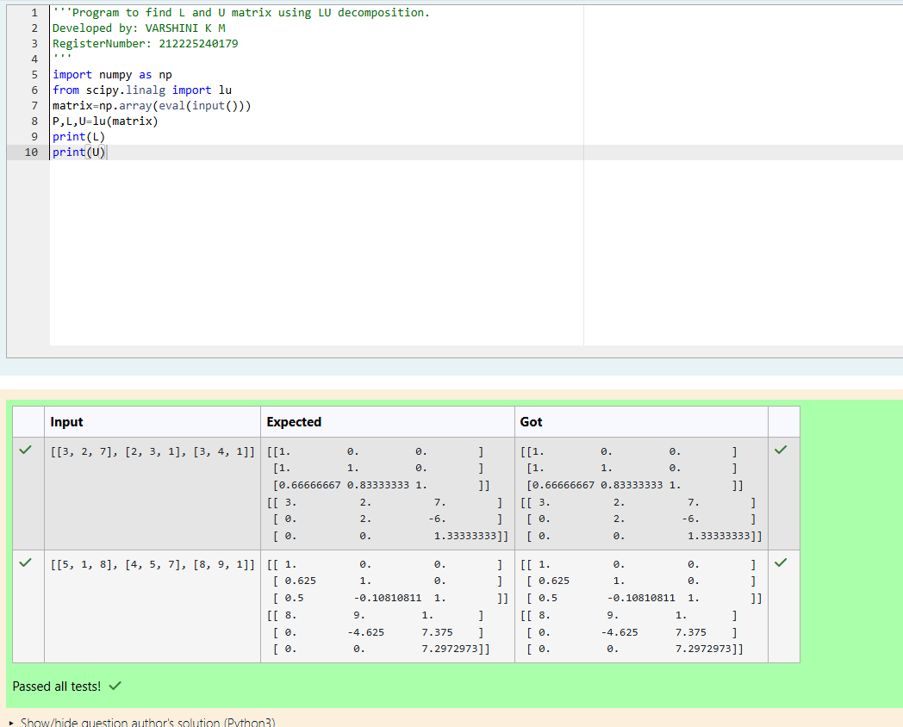

# LU Decomposition 

## AIM:
To write a program to find the LU Decomposition of a matrix.

## Equipments Required:
1. Hardware – PCs
2. Anaconda – Python 3.7 Installation / Moodle-Code Runner

## Algorithm
1. Import the required libraries NumPy and scipy.linalg for performing matrix operations and LU decomposition.

2. Read the input matrix from the user and store it as a NumPy array.

3. Use the lu() function to decompose the matrix into L (Lower triangular) and U (Upper triangular) matrices.

4. Display the L matrix, U matrix, and solve the system of equations using lu_factor() and lu_solve() functions. 

## Program:
(i) To find the L and U matrix
```
'''Program to find L and U matrix using LU decomposition.
Developed by: VARSHINI K M
RegisterNumber: 212225240179
'''
import numpy as np
from scipy.linalg import lu 
matrix=np.array(eval(input()))
P,L,U=lu(matrix)
print(L)
print(U)
```

(ii) To find the LU Decomposition of a matrix

```
'''Program to solve a matrix using LU decomposition.
Developed by: VARSHINI K M
RegisterNumber: 212225240179
'''

# To print X matrix (solution to the equations)
import numpy as np
from scipy.linalg import lu_factor, lu_solve
A=np.array(eval(input()))
b=np.array(eval(input()))
lu,piv=lu_factor(A)
print(lu_solve((lu,piv),b))
```

## Output:



## Result:
Thus the program to find the LU Decomposition of a matrix is written and verified using python programming.

